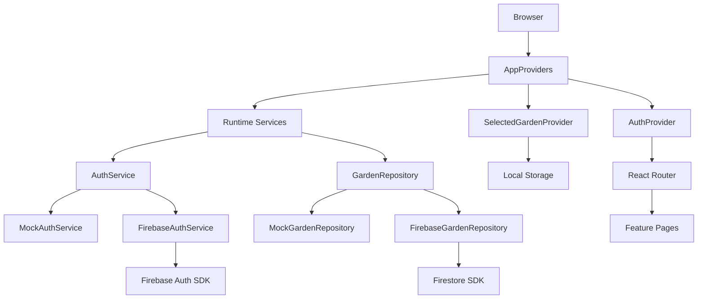
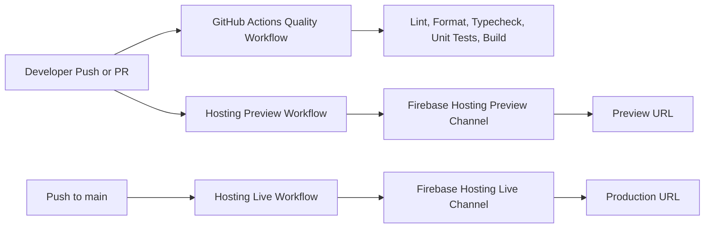

# Architecture

## Scope and non-goals

Milestone 1 is a foundation milestone. It proves the routing, auth shell, adapter boundaries, Firebase surface, and delivery pipeline. It does not attempt to ship plot editing, planting workflows, reminders, collaboration invites, or weather logic.

Non-goals for this milestone:

- no custom server or Cloud Functions
- no live weather or plant data integration
- no background sync or aggressive runtime caching
- no state library or query framework

## Stack and rationale

- React + React Router: low-friction SPA composition and route testing
- TypeScript: explicit contracts between domain, features, and infrastructure
- Vite: small SPA toolchain with fast local iteration
- CSS Modules + CSS variables: scoped styling without a component library
- Firebase modular SDK: future auth/data backend surface without server code
- `vite-plugin-pwa`: manifest and service-worker generation with conservative defaults

## Directory structure

```text
src/
  app/
    App.tsx
    router.tsx
    providers.tsx
    routes/
  features/
    auth/
    gardens/
  domain/
    auth/
    gardens/
  infrastructure/
    firebase/
    mock/
    runtime/
  shared/
    config/
    lib/
    styles/
    ui/
  test/
e2e/
docs/
```

## Runtime dependency flow



## Runtime data flow

1. `resolveAppEnvironment()` reads `import.meta.env`.
2. `createRuntimeServices()` selects mock or Firebase implementations.
3. `AppProviders` provides the selected services.
4. `AuthProvider` subscribes to `AuthService` and exposes auth state.
5. `SelectedGardenProvider` stores the selected garden ID in local storage per user.
6. Route guards read auth state and selected garden state to redirect.
7. Feature pages call repository interfaces, not Firebase directly.

## Mock-first and future-live adapter strategy

`AuthService`

- `MockAuthService` supports deterministic local sign-in without credentials
- `FirebaseAuthService` wraps email-link auth using the modular SDK
- both implementations persist same-device email locally for link completion

`GardenRepository`

- `MockGardenRepository` returns deterministic garden summaries
- `FirebaseGardenRepository` queries member documents and garden documents
- UI code depends on the interface, not the backing store

This is the central seam for later milestones. Expanding those interfaces is acceptable. Bypassing them from feature code is not.

## Route map

| Route                | Purpose                                                     |
| -------------------- | ----------------------------------------------------------- |
| `/`                  | redirect based on auth state and selected garden            |
| `/sign-in`           | request an email sign-in link                               |
| `/auth/complete`     | complete same-device or different-device email-link sign-in |
| `/gardens`           | select a garden context                                     |
| `/gardens/:gardenId` | minimal garden shell                                        |
| `*`                  | not-found fallback                                          |

## Auth flow

1. User lands on `/sign-in`.
2. The email is validated locally.
3. `AuthService.requestEmailSignIn()` sends the real Firebase link or returns a mock completion link.
4. The requested email is stored locally for same-device completion.
5. `/auth/complete` checks whether the current URL is a recognized email-link format.
6. If the stored email exists, sign-in completes immediately.
7. If the link was opened on a different device, the page asks the user to re-enter the email.
8. Successful sign-in persists session state and redirects through `/`.

## Firestore data model draft

Top-level collections:

- `users/{uid}`
- `gardens/{gardenId}`
- `gardens/{gardenId}/members/{uid}`
- `gardens/{gardenId}/plots/{plotId}`
- `gardens/{gardenId}/plantings/{plantingId}`

Draft fields:

`users`

- `email`
- `displayName`
- `lastGardenId`
- `createdAt`
- `updatedAt`

`gardens`

- `name`
- `slug`
- `ownerUid`
- `timezone`
- `dimensions`
- `createdAt`
- `updatedAt`

`members`

- `uid`
- `role`
- `createdAt`

`plots`

- `name`
- `x`
- `y`
- `width`
- `height`
- `rotation`
- `createdAt`
- `updatedAt`

`plantings`

- `plotId`
- `plantId`
- `plantedOn`
- `expectedGerminationStart`
- `expectedGerminationEnd`
- `spacingCm`
- `wateringCadenceDays`
- `status`
- `notes`
- `createdAt`
- `updatedAt`

The TypeScript draft model lives in `src/domain/gardens/schema.ts`.

## Security model summary

- deny by default
- users can read and update only their own user document
- garden reads require membership
- only owners can manage membership and update/delete the garden document
- owners and editors can write plots and plantings
- viewers remain read-only

Current limitations:

- rules do not yet validate document field shapes in depth
- rules assume the member subcollection is the source of truth for garden access
- future milestones should harden role transitions and create/update schema validation

## CI/CD and hosting flow



## Extension points for future milestones

- expand `GardenRepository` with plot and planting reads/writes
- add additional repositories instead of widening UI components into data layers
- seed emulator data when live Firebase work becomes part of active scope
- keep mock implementations available as the default CI path
- treat rules and docs as part of any schema change, not as follow-up work
